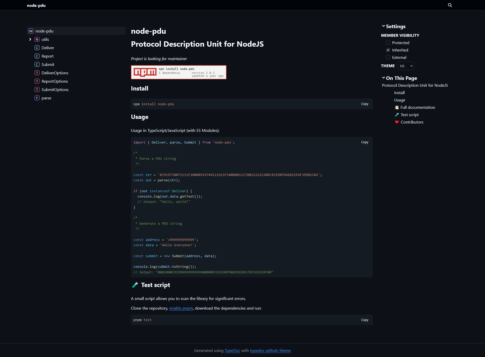

# Theme your TypeDoc like GitHub

[](https://npmjs.org/package/typedoc-github-theme)

This [TypeDoc](https://github.com/TypeStrong/typedoc) theme is designed to provide an elegant and seamless look and feel for your TypeScript documentation on GitHub Pages, inspired by the GitHub design.

## Example

[](https://killerjulian.github.io/typedoc-github-theme/)

## Usage

**Install the package with your favourite package manager:**

```text
npm install typedoc-github-theme
```

```text
pnpm install typedoc-github-theme
```

```text
yarn add typedoc-github-theme
```

**Use the theme when generating your documentation:**

```text
typedoc src/** */ --plugin typedoc-github-theme --theme typedoc-github-theme
```

---

## Author

👤 **KillerJulian <info@killerjulian.de>**

- Github: [@KillerJulian](https://github.com/KillerJulian)

## 🤝 Contributing

Contributions, issues and feature requests are welcome!<br />Feel free to check the [issues page](https://github.com/KillerJulian/typedoc-github-theme/issues). You can also take a look at the [contributing guide](https://github.com/KillerJulian/typedoc-github-theme/blob/master/CONTRIBUTING.md).
